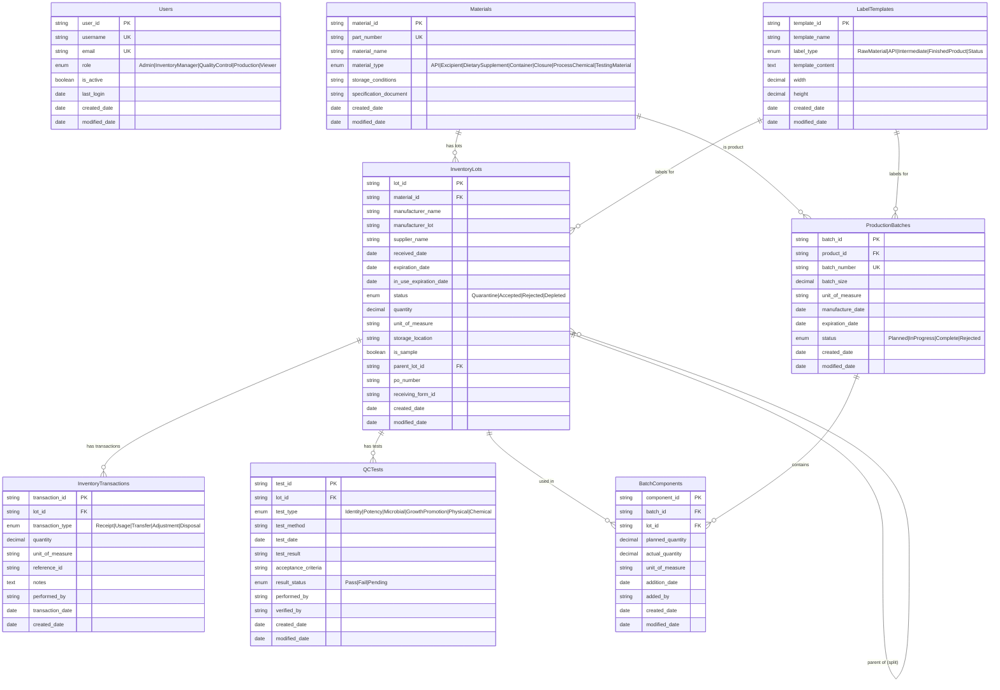
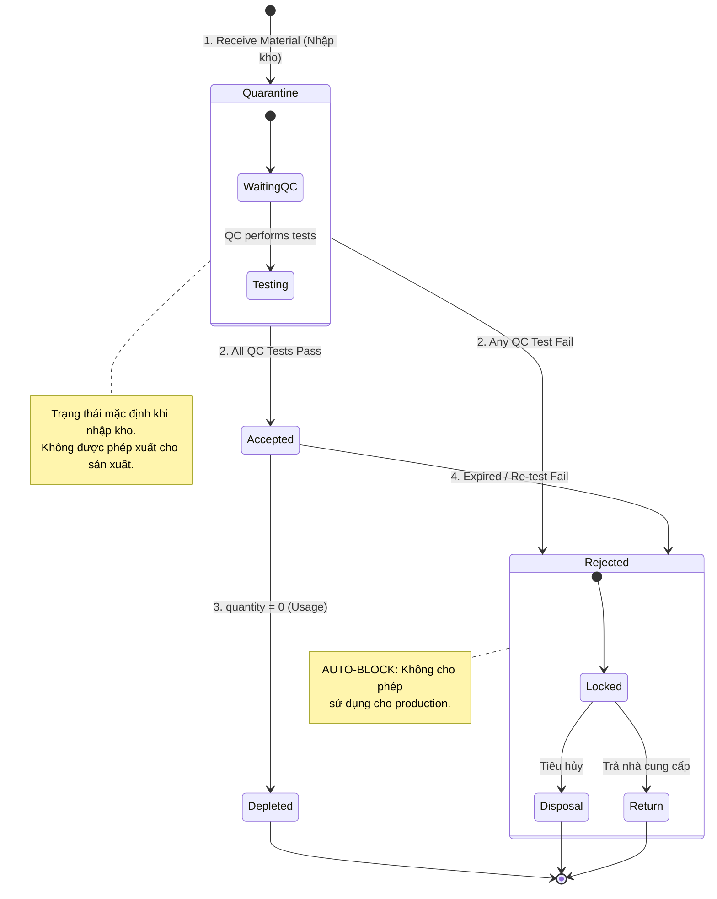
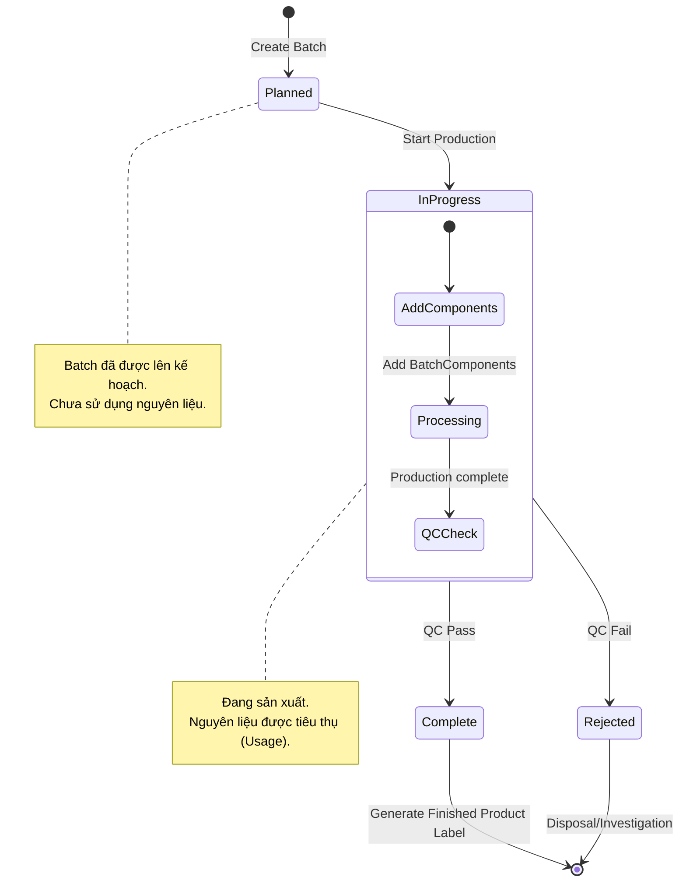

# Domain Model: Hệ thống Quản lý Kho (Inventory Management System)

Tài liệu này mô tả chi tiết mô hình dữ liệu, các thực thể nghiệp vụ và quy tắc chuyển đổi trạng thái.

Dựa trên [Inventory Management System Database Schema](https://nhbien.github.io/inventory-mangement-system-database-schema/)

---

## 1. Tổng quan Entity Relationship

```
Materials ──1:N──► InventoryLots ──1:N──► InventoryTransactions
    │                    │
    │                    ├──1:N──► QCTests
    │                    │
    │                    └──1:N──► BatchComponents ◄──N:1── ProductionBatches
    │                                                              │
    └──────────────────1:N (product_id)───────────────────────────┘

LabelTemplates ──used by──► InventoryLots (Raw Material, API, Status labels)
LabelTemplates ──used by──► ProductionBatches (Finished Product, Intermediate labels)

Users (standalone - manages all operations)
```

---

## 2. Mô hình Thực thể (Entities)

### 2.1. Users (Người dùng)

Quản lý tài khoản người dùng và phân quyền trong hệ thống.

| Column | Type | Constraints | Mô tả |
|--------|------|-------------|-------|
| user_id | STRING(36) | PK, NOT NULL | UUID primary key (= Keycloak sub) |
| username | STRING(50) | NOT NULL, UNIQUE | Tên đăng nhập |
| email | STRING(100) | NOT NULL, UNIQUE | Email (validated) |
| role | ENUM | NOT NULL, default: 'Viewer' | Vai trò người dùng |
| is_active | BOOLEAN | default: true | Trạng thái tài khoản |
| last_login | DATE | nullable | Lần đăng nhập cuối |
| created_date | DATE | default: NOW | Ngày tạo |
| modified_date | DATE | default: NOW | Ngày cập nhật |

**ENUM role:**
- `Admin` - Quản trị toàn bộ hệ thống
- `InventoryManager` - Quản lý kho, nhập/xuất hàng
- `QualityControl` - Kiểm tra chất lượng
- `Production` - Sản xuất
- `Viewer` - Chỉ xem

---

### 2.2. Materials (Nguyên vật liệu)

Master data cho nguyên vật liệu, API, bao bì, v.v.

| Column | Type | Constraints | Mô tả |
|--------|------|-------------|-------|
| material_id | STRING(20) | PK, NOT NULL | Mã định danh vật liệu |
| part_number | STRING(20) | NOT NULL, UNIQUE | Mã part (PART-xxxxx) |
| material_name | STRING(100) | NOT NULL | Tên hiển thị |
| material_type | ENUM | NOT NULL | Loại vật liệu |
| storage_conditions | STRING(100) | nullable | Điều kiện bảo quản |
| specification_document | STRING(50) | nullable | Tài liệu quy cách |
| created_date | DATE | default: NOW | Ngày tạo |
| modified_date | DATE | default: NOW | Ngày cập nhật |

**ENUM material_type:**
- `API` - Active Pharmaceutical Ingredient
- `Excipient` - Tá dược
- `Dietary Supplement` - Thực phẩm chức năng
- `Container` - Bao bì
- `Closure` - Nắp đậy
- `Process Chemical` - Hóa chất sản xuất
- `Testing Material` - Vật liệu thử nghiệm

---

### 2.3. LabelTemplates (Mẫu nhãn)

Mẫu nhãn để in cho nguyên vật liệu và sản phẩm.

| Column | Type | Constraints | Mô tả |
|--------|------|-------------|-------|
| template_id | STRING(20) | PK, NOT NULL | Mã mẫu nhãn |
| template_name | STRING(100) | NOT NULL | Tên mẫu |
| label_type | ENUM | NOT NULL | Loại nhãn |
| template_content | TEXT | NOT NULL | Nội dung/layout nhãn |
| width | DECIMAL(5,2) | NOT NULL | Chiều rộng (inches) |
| height | DECIMAL(5,2) | NOT NULL | Chiều cao (inches) |
| created_date | DATE | default: NOW | Ngày tạo |
| modified_date | DATE | default: NOW | Ngày cập nhật |

**ENUM label_type:**
- `Raw Material` - Nhãn nguyên liệu thô
- `API` - Nhãn cho vật liệu có material_type = `API`
- `Sample` - Nhãn mẫu thử
- `Intermediate` - Nhãn sản phẩm trung gian
- `Finished Product` - Nhãn thành phẩm
- `Status` - Nhãn trạng thái (Quarantine/Accepted/Rejected)

**Quy tắc Label Generation:**
> Label được generate từ dữ liệu của **InventoryLot** hoặc **ProductionBatch**, KHÔNG phải từ Transaction.

**Quy tắc phân loại Label theo Material Type:**
- Nếu `Materials.material_type = 'API'` → label_type = `API`.
- Nếu `Materials.material_type ≠ 'API'` → label_type = `Raw Material`.

| Label Type | Data Source | Thời điểm generate |
|------------|-------------|-------------------|
| Raw Material | InventoryLot + Material | Khi nhận hàng vào kho |
| Sample | InventoryLot (is_sample=true) + Material | Khi tạo lô mẫu thử (Split) |
| API | InventoryLot + Material | Khi nhận API |
| Status | InventoryLot (status) | Khi status thay đổi |
| Intermediate | ProductionBatch | Trong quá trình sản xuất |
| Finished Product | ProductionBatch + Material | Khi batch hoàn thành |

---

### 2.4. InventoryLots (Lô hàng)

Các lô hàng cụ thể của một nguyên vật liệu (mỗi đợt nhận hàng là một lot).

| Column | Type | Constraints | Mô tả |
|--------|------|-------------|-------|
| lot_id | STRING(36) | PK, NOT NULL | UUID primary key |
| material_id | STRING(20) | FK→Materials, NOT NULL | Vật liệu của lô |
| manufacturer_name | STRING(100) | NOT NULL | Tên nhà sản xuất |
| manufacturer_lot | STRING(50) | NOT NULL | Số lô của nhà sản xuất |
| supplier_name | STRING(100) | nullable | Tên nhà cung cấp |
| received_date | DATEONLY | NOT NULL | Ngày nhận hàng |
| expiration_date | DATEONLY | NOT NULL | Ngày hết hạn |
| in_use_expiration_date | DATEONLY | nullable | Hạn sử dụng sau khi mở |
| status | ENUM | NOT NULL | Trạng thái lô hàng |
| quantity | DECIMAL(10,3) | NOT NULL | Số lượng hiện tại |
| unit_of_measure | STRING(10) | NOT NULL | Đơn vị (kg, L, each) |
| storage_location | STRING(50) | nullable | Vị trí kho |
| is_sample | BOOLEAN | default: false | Có phải lô mẫu |
| parent_lot_id | STRING(36) | FK→InventoryLots, nullable | Lô gốc (nếu split) |
| po_number | STRING(30) | nullable | Số PO |
| receiving_form_id | STRING(50) | nullable | Mã phiếu nhận hàng |
| created_date | DATE | default: NOW | Ngày tạo |
| modified_date | DATE | default: NOW | Ngày cập nhật |

**ENUM status:**
- `Quarantine` - Đang chờ kiểm định (mặc định khi nhập kho)
- `Accepted` - Đã qua QC, được phép sử dụng
- `Rejected` - Không đạt QC
- `Depleted` - Đã hết hàng (quantity = 0)

**Quy tắc nghiệp vụ quan trọng:**
> **AUTO-BLOCK:** Hệ thống tự động **CHẶN** mọi thao tác xuất kho đối với các lô hàng có:
> - Status = `Rejected`
> - Status = `Quarantine` (chưa qua QC)
> - Đã quá `expiration_date`

---

### 2.5. InventoryTransactions (Giao dịch kho)

Lịch sử di chuyển và sử dụng của mỗi lô hàng.

| Column | Type | Constraints | Mô tả |
|--------|------|-------------|-------|
| transaction_id | STRING(36) | PK, NOT NULL | UUID primary key |
| lot_id | STRING(36) | FK→InventoryLots, NOT NULL | Lô bị ảnh hưởng |
| transaction_type | ENUM | NOT NULL | Loại giao dịch |
| quantity | DECIMAL(10,3) | NOT NULL | Số lượng (+/-) |
| unit_of_measure | STRING(10) | NOT NULL | Đơn vị |
| reference_id | STRING(50) | nullable | ID tham chiếu (batch, order) |
| notes | TEXT | nullable | Ghi chú |
| performed_by | STRING(50) | NOT NULL | Người thực hiện |
| transaction_date | DATE | NOT NULL, default: NOW | Ngày thực hiện |
| created_date | DATE | default: NOW | Ngày tạo |

**ENUM transaction_type:**
| Type | Mô tả | Quantity Effect |
|------|-------|-----------------|
| `Receipt` | Nhận hàng vào kho | +quantity |
| `Usage` | Sử dụng cho production | -quantity |
| `Split` | Chia lô hàng (tạo lô mẫu/lô con) | -quantity (từ lô gốc) |
| `Transfer` | Chuyển location | 0 (chỉ đổi location) |
| `Adjustment` | Điều chỉnh số lượng | ±quantity |
| `Disposal` | Hủy bỏ | -quantity |

---

### 2.6. QCTests (Kiểm tra chất lượng)

Kết quả kiểm tra chất lượng cho các lô hàng.

| Column | Type | Constraints | Mô tả |
|--------|------|-------------|-------|
| test_id | STRING(36) | PK, NOT NULL | UUID primary key |
| lot_id | STRING(36) | FK→InventoryLots, NOT NULL | Lô được kiểm tra |
| test_type | ENUM | NOT NULL | Loại test |
| test_method | STRING(100) | NOT NULL | Phương pháp/SOP |
| test_date | DATEONLY | NOT NULL | Ngày thực hiện |
| test_result | STRING(100) | NOT NULL | Kết quả |
| acceptance_criteria | STRING(200) | nullable | Tiêu chí chấp nhận |
| result_status | ENUM | NOT NULL | Trạng thái kết quả |
| performed_by | STRING(50) | NOT NULL | Người thực hiện |
| verified_by | STRING(50) | nullable | Người xác nhận |
| created_date | DATE | default: NOW | Ngày tạo |
| modified_date | DATE | default: NOW | Ngày cập nhật |

**ENUM test_type:**
- `Identity` - Định danh
- `Potency` - Hiệu lực
- `Microbial` - Vi sinh
- `Growth Promotion` - Xúc tiến tăng trưởng
- `Physical` - Vật lý
- `Chemical` - Hóa học

**ENUM result_status:**
- `Pass` - Đạt
- `Fail` - Không đạt
- `Pending` - Đang chờ

---

### 2.7. ProductionBatches (Lô sản xuất)

Các đợt sản xuất sản phẩm.

| Column | Type | Constraints | Mô tả |
|--------|------|-------------|-------|
| batch_id | STRING(36) | PK, NOT NULL | UUID primary key |
| product_id | STRING(20) | FK→Materials, NOT NULL | Sản phẩm (Material) |
| batch_number | STRING(50) | NOT NULL, UNIQUE | Số lô sản xuất |
| batch_size | DECIMAL(10,3) | NOT NULL | Kích thước lô |
| unit_of_measure | STRING(10) | NOT NULL | Đơn vị |
| manufacture_date | DATEONLY | NOT NULL | Ngày sản xuất |
| expiration_date | DATEONLY | NOT NULL | Ngày hết hạn |
| status | ENUM | NOT NULL | Trạng thái |
| created_date | DATE | default: NOW | Ngày tạo |
| modified_date | DATE | default: NOW | Ngày cập nhật |

**ENUM status:**
- `Planned` - Đã lên kế hoạch
- `In Progress` - Đang sản xuất
- `Complete` - Hoàn thành
- `Rejected` - Bị từ chối

---

### 2.8. BatchComponents (Thành phần lô sản xuất)

Liên kết lô sản xuất với các lô nguyên liệu được sử dụng.

| Column | Type | Constraints | Mô tả |
|--------|------|-------------|-------|
| component_id | STRING(36) | PK, NOT NULL | UUID primary key |
| batch_id | STRING(36) | FK→ProductionBatches, NOT NULL | Lô sản xuất |
| lot_id | STRING(36) | FK→InventoryLots, NOT NULL | Lô nguyên liệu |
| planned_quantity | DECIMAL(10,3) | NOT NULL | Số lượng dự kiến |
| actual_quantity | DECIMAL(10,3) | nullable | Số lượng thực tế |
| unit_of_measure | STRING(10) | NOT NULL | Đơn vị |
| addition_date | DATE | nullable | Ngày thêm component |
| added_by | STRING(50) | nullable | Người thêm |
| created_date | DATE | default: NOW | Ngày tạo |
| modified_date | DATE | default: NOW | Ngày cập nhật |

---

## 3. Sơ đồ Quan hệ (Entity Relationship Diagram)



---

## 4. Biểu đồ Trạng thái Lô hàng (InventoryLot State Diagram)



---

## 5. Biểu đồ Trạng thái Lô Sản xuất (ProductionBatch State Diagram)



---

## 6. Luồng Nghiệp vụ Chính (Main Workflow)

```
┌─────────────────────────────────────────────────────────────────────────────────┐
│                            INVENTORY MANAGEMENT WORKFLOW                         │
├─────────────────────────────────────────────────────────────────────────────────┤
│                                                                                 │
│  PHASE 0: MASTER DATA                                                           │
│  ════════════════════                                                           │
│  Users → Materials → LabelTemplates                                             │
│                                                                                 │
│  PHASE 1: RECEIVING (Nhận hàng)                                                 │
│  ══════════════════════════════                                                 │
│  Material ──► InventoryLot ──► Transaction (Receipt) ──► Label (Raw Material)  │
│               │                                                                 │
│               └── status: Quarantine (mặc định)                                 │
│                                                                                 │
│  PHASE 2: QC TESTING (Kiểm tra chất lượng)                                      │
│  ═════════════════════════════════════════                                      │
│  InventoryLot ──► QCTests (Identity, Potency, ...)                              │
│               │                                                                 │
│               ├── All Pass → status: Accepted → Label (Status)                  │
│               └── Any Fail → status: Rejected → Label (Status)                  │
│                                                                                 │
│  PHASE 3: PRODUCTION (Sản xuất)                                                 │
│  ══════════════════════════════                                                 │
│  ProductionBatch (Planned) ──► BatchComponents ──► Transaction (Usage)          │
│       │                              │                                          │
│       │                              └── Link InventoryLot to Batch             │
│       └── status: In Progress                                                   │
│                                                                                 │
│  PHASE 4: COMPLETE (Hoàn thành)                                                 │
│  ══════════════════════════════                                                 │
│  ProductionBatch ──► status: Complete ──► Label (Finished Product)              │
│                                                                                 │
└─────────────────────────────────────────────────────────────────────────────────┘
```

---

## 7. Quy tắc Kiểm soát & Truy xuất

### 7.1. Quy tắc nhập kho (Receiving)
- Khi nhập kho, InventoryLot **tự động** có status = `Quarantine`
- Không được phép cấp phát lô này cho sản xuất cho đến khi QC approve

### 7.2. Quy tắc QC
- Tất cả QCTests phải `Pass` → Lot status = `Accepted`
- Bất kỳ QCTest nào `Fail` → Lot status = `Rejected`
- QC kết quả phải được `verified_by` (QC Supervisor) xác nhận

### 7.3. Quy tắc sử dụng (Usage)
- Chỉ lot có status = `Accepted` mới được sử dụng cho Production
- Khi thêm BatchComponent → tự động tạo Transaction type = `Usage`
- Quantity của InventoryLot giảm tương ứng

### 7.4. Quy tắc hết hạn (Expiration)
- Cronjob chạy hàng ngày kiểm tra `expiration_date`
- Nếu quá hạn → tự động chuyển status sang `Rejected` và khóa lô

### 7.5. Nhật ký hệ thống (Audit Trail)
- Mọi thay đổi số lượng → sinh InventoryTransaction
- Mọi thay đổi trạng thái → lưu trong `modified_date`
- Lưu lại: Ai làm (`performed_by`), Lúc nào (`transaction_date`), Ghi chú (`notes`)

---

## 8. Ma trận Phân quyền (User Roles & Permissions)

| Chức năng | Admin | InventoryManager | QualityControl | Production | Viewer |
|-----------|-------|------------------|----------------|------------|--------|
| Quản lý Users | ✅ | ❌ | ❌ | ❌ | ❌ |
| CRUD Materials | ✅ | ✅ | 👁️ | 👁️ | 👁️ |
| CRUD LabelTemplates | ✅ | ✅ | ❌ | ❌ | 👁️ |
| Receive InventoryLots | ✅ | ✅ | ❌ | ❌ | 👁️ |
| Perform QCTests | ✅ | ❌ | ✅ | ❌ | 👁️ |
| Update Lot Status | ✅ | ✅ | ✅ | ❌ | 👁️ |
| Create ProductionBatch | ✅ | ❌ | ❌ | ✅ | 👁️ |
| Add BatchComponents | ✅ | ❌ | ❌ | ✅ | 👁️ |
| Generate Labels | ✅ | ✅ | ✅ | ✅ | ❌ |
| View Reports | ✅ | ✅ | ✅ | ✅ | ✅ |

**Legend:** ✅ Full Access | 👁️ View Only | ❌ No Access

---

*Document based on [Inventory Management System Database Schema](https://nhbien.github.io/inventory-mangement-system-database-schema/)*
