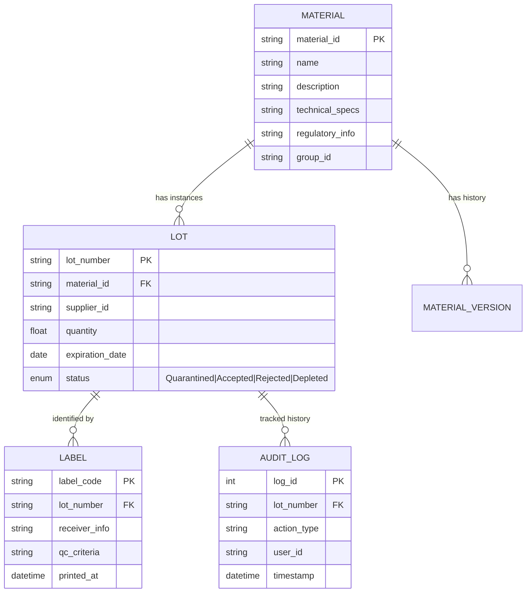
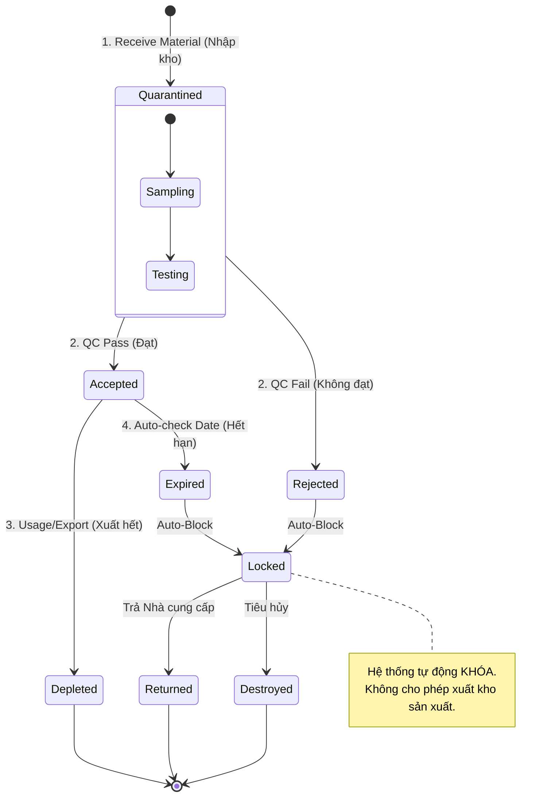

# Domain Model: Hệ thống Quản lý Kho

Tài liệu này mô tả chi tiết mô hình dữ liệu, các thực thể nghiệp vụ và quy tắc chuyển đổi trạng thái.

## 1. Mô hình Thực thể (Entities)

### 1.1. Nguyên vật liệu (Material)
Đại diện cho định nghĩa "Master Data" của một loại hàng hóa.
*   **Thông tin định danh:** Mã định danh (Material ID), Tên, Mô tả.
*   **Thông số kỹ thuật:** Các chỉ số kỹ thuật, điều kiện bảo quản.
*   **Thông tin tuân thủ:** Các quy định pháp luật liên quan (Regulatory info).
*   **Phân loại:** Nhóm nguyên vật liệu (Material Group).
*   **Quản lý phiên bản:** Lưu trữ lịch sử thay đổi và quản lý version của định nghĩa vật liệu.

### 1.2. Lô hàng (Lot Tracking & Control)
Đại diện cho một đợt hàng cụ thể (Instance) của một Nguyên vật liệu. Đây là đối tượng chính của việc truy xuất nguồn gốc.
*   **Thông tin lô:** Mã lô (Lot Number), Nhà cung cấp, Số lượng ban đầu, Số lượng hiện tại.
*   **Thời gian:** Ngày sản xuất, Ngày nhập kho, **Ngày hết hạn (Expiration Date)**.
*   **Trạng thái (Status):**
    *   `Quarantined` (Đang chờ kiểm định): Trạng thái mặc định khi nhập kho.
    *   `Accepted` (Chấp nhận): Đã qua QC, được phép sử dụng.
    *   `Rejected` (Từ chối): Không đạt QC, cần trả về hoặc hủy.
    *   `Depleted` (Đã hết hàng): Số lượng về 0.
*   **Nhật ký (Logging):** Ghi lại toàn bộ lịch sử nhập, xuất, kiểm kê, chuyển giao gắn với mã lô.

**Quy tắc nghiệp vụ quan trọng:**
> **AUTO-BLOCK:** Hệ thống tự động **CHẶN/KHÓA** mọi thao tác xuất kho đối với các lô hàng có trạng thái là **Rejected** hoặc **Đã quá hạn sử dụng**.

### 1.3. Tem nhãn (Labeling & Printing)
*   **Tạo nhãn:** Tự động sinh mã nhãn (Barcode/QR) khi tiếp nhận lô hàng.
*   **Nội dung nhãn:** Mã vật liệu, Tên, Mã lô, Thông tin người nhận, Số lượng, Nhà cung cấp, Các tiêu chí kiểm định (nếu có).
*   **Mục đích:** Quét mã để thực hiện nhập/xuất kho nhanh chóng.

## 2. Sơ đồ Quan hệ (Entity Relationship Diagram)

## 3. Biểu đồ Trạng thái Lô hàng (Lot State Diagram)

Mô tả vòng đời và các quy tắc chuyển đổi trạng thái của một lô hàng.

## 4. Chiến lược Truy xuất & Kiểm soát

### 4.1. Quy trình Kiểm soát (Control)
*   Khi nhập kho, lô hàng auto ở trạng thái `Quarantined`. Kho không được phép cấp phát lô này cho đến khi có kết quả QC.
*   QC cập nhật trạng thái trên hệ thống -> Nếu `Accepted`, lô hàng khả dụng (Available stock).
*   Cronjob chạy hàng ngày kiểm tra `Expiration Date` -> Nếu quá hạn, tự động chuyển trạng thái sang `Expired` (hoặc Rejected vì lý do hết hạn) và khóa lô.

### 4.2. Nhật ký hệ thống (Audit Trail)
*   Mọi thay đổi số lượng (Nhập/Xuất/Kiểm kê) đều sinh ra bản ghi Log.
*   Mọi thay đổi trạng thái (QC Approve/Reject) đều lưu lại: Ai làm? Lúc nào? Lý do là gì?
