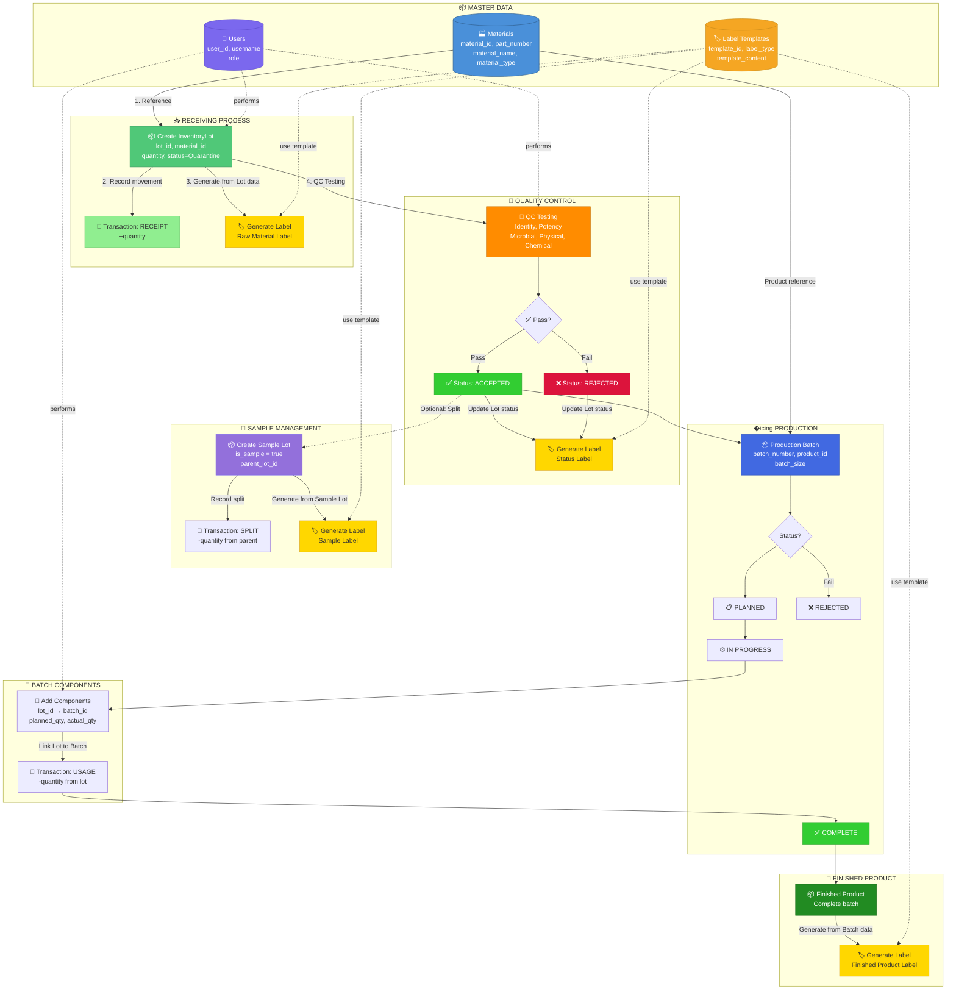

# Inventory Management System - Workflow Diagram

## Tổng quan quy trình

Dựa trên database schema từ [Inventory Management System Database Schema](https://nhbien.github.io/inventory-mangement-system-database-schema/)

---

## 1. Entity Relationship Diagram

```
┌─────────────────────────────────────────────────────────────────────────────────────┐
│                                                                                     │
│   Materials ──1:N──► InventoryLots ──1:N──► InventoryTransactions                   │
│       │                    │                                                        │
│       │                    ├──1:N──► QCTests                                        │
│       │                    │                                                        │
│       │                    └──1:N──► BatchComponents ◄──N:1── ProductionBatches     │
│       │                                                              │              │
│       └──────────────────1:N (product_id)────────────────────────────┘              │
│                                                                                     │
│   LabelTemplates ──used by──► InventoryLots (Raw Material, Sample, API, Status)     │
│   LabelTemplates ──used by──► ProductionBatches (Finished Product, Intermediate)    │
│                                                                                     │
│   Users (standalone - manages all operations)                                       │
│                                                                                     │
└─────────────────────────────────────────────────────────────────────────────────────┘
```

---

## 2. Main Workflow Diagram

> **Luồng chính theo tài liệu:** Material → InventoryLot → Transaction → Label Generation
> 
> Label được generate từ dữ liệu của **InventoryLot** (kết hợp với Material), không phải từ Transaction.



### Giải thích luồng chính:

| Bước | Từ | Đến | Mô tả |
|------|-----|-----|-------|
| 1 | Materials | InventoryLot | Lot tham chiếu đến Material (material_id) |
| 2 | InventoryLot | InventoryTransaction | Ghi nhận giao dịch Receipt (+quantity) |
| 3 | InventoryLot | Label (Raw Material) | Generate label từ dữ liệu Lot + Material |
| 4 | InventoryLot | QCTests | Thực hiện kiểm tra chất lượng |
| 5 | QCTests Pass | InventoryLot | Cập nhật status: Quarantine → Accepted |
| 6 | InventoryLot | Label (Status) | Generate label trạng thái mới |

---

## 3. Detailed Process Flow

### 3.1 Material Receipt Flow

```
┌──────────────────────────────────────────────────────────────────────────────────┐
│                           MATERIAL RECEIPT FLOW                                   │
│   Theo tài liệu: Material → InventoryLot → Transaction → Label                   │
├──────────────────────────────────────────────────────────────────────────────────┤
│                                                                                  │
│  STEP 1              STEP 2                    STEP 3                            │
│  ┌─────────────┐     ┌─────────────────────┐   ┌─────────────────────────┐       │
│  │  Materials  │────►│  Create             │──►│  InventoryTransaction   │       │
│  │  (Master)   │     │  InventoryLot       │   │  Type: RECEIPT          │       │
│  │  MAT-001    │     │  lot_id: lot-001    │   │  Quantity: +25.5 kg     │       │
│  └─────────────┘     │  material_id: MAT-001│   │  lot_id: lot-001        │       │
│        │             │  quantity: 25.5 kg  │   └─────────────────────────┘       │
│        │             │  status: Quarantine │                                     │
│        │             └──────────┬──────────┘                                     │
│        │                        │                                                │
│        │                        │ STEP 4: Generate Label từ dữ liệu Lot          │
│        │                        ▼                                                │
│        │             ┌─────────────────────┐   ┌─────────────────────────┐       │
│        │             │  LabelTemplates     │──►│  🏷️ RAW MATERIAL LABEL │       │
│        └────────────►│  Type: Raw Material │   │  Material: Vitamin D3   │       │
│                      │  TPL-RM-01          │   │  Lot: lot-001           │       │
│                      └─────────────────────┘   │  Qty: 25.5 kg           │       │
│                                                │  Status: ⚠️ QUARANTINE  │       │
│                                                └─────────────────────────┘       │
│                                                                                  │
│  📌 Label data comes from: InventoryLot (lot_id, quantity, status, exp_date)    │
│                          + Materials (material_name, storage_conditions)         │
│                                                                                  │
└──────────────────────────────────────────────────────────────────────────────────┘
```

### 3.2 Quality Control Flow

```
┌────────────────────────────────────────────────────────────────────────────┐
│                         QUALITY CONTROL FLOW                               │
├────────────────────────────────────────────────────────────────────────────┤
│                                                                            │
│  ┌─────────────┐    ┌─────────────────────────────────────────────────┐   │
│  │ InventoryLot│───►│              QC TESTING                         │   │
│  │ (Quarantine)│    │  ┌──────────┬──────────┬──────────┬──────────┐  │   │
│  └─────────────┘    │  │ Identity │ Potency  │ Microbial│ Physical │  │   │
│                     │  └──────────┴──────────┴──────────┴──────────┘  │   │
│                     └─────────────────────────────────────────────────┘   │
│                                        │                                   │
│                                        ▼                                   │
│                              ┌─────────────────┐                           │
│                              │   All Pass?     │                           │
│                              └────────┬────────┘                           │
│                                       │                                    │
│                     ┌─────────────────┼─────────────────┐                  │
│                     ▼                 │                 ▼                  │
│            ┌─────────────┐            │        ┌─────────────┐             │
│            │  ACCEPTED   │            │        │  REJECTED   │             │
│            │  ✅ Pass    │            │        │  ❌ Fail    │             │
│            └─────────────┘            │        └─────────────┘             │
│                     │                 │                 │                  │
│                     └─────────────────┼─────────────────┘                  │
│                                       ▼                                    │
│                              ┌─────────────────┐                           │
│                              │  Status Label   │                           │
│                              │  Generated      │                           │
│                              └─────────────────┘                           │
│                                                                            │
└────────────────────────────────────────────────────────────────────────────┘
```

### 3.3 Production Batch Flow

```
┌────────────────────────────────────────────────────────────────────────────┐
│                         PRODUCTION BATCH FLOW                              │
├────────────────────────────────────────────────────────────────────────────┤
│                                                                            │
│  ┌───────────────┐                                                         │
│  │ Production    │                                                         │
│  │ Batch Created │                                                         │
│  │ Status:PLANNED│                                                         │
│  └───────┬───────┘                                                         │
│          │                                                                 │
│          ▼                                                                 │
│  ┌───────────────┐    ┌─────────────────┐    ┌─────────────────────────┐  │
│  │ Status:       │───►│ BatchComponents │───►│ InventoryTransaction   │  │
│  │ IN PROGRESS   │    │ Add Lot to Batch│    │ Type: USAGE            │  │
│  └───────────────┘    │ planned_qty: 2kg│    │ Quantity: -2 kg        │  │
│                       │ actual_qty: 2kg │    └─────────────────────────┘  │
│                       └─────────────────┘                                  │
│          │                                                                 │
│          ▼                                                                 │
│  ┌───────────────┐    ┌─────────────────┐                                  │
│  │ Status:       │───►│ Generate Label  │                                  │
│  │ COMPLETE      │    │ Type: Finished  │                                  │
│  └───────────────┘    │ Product         │                                  │
│                       └─────────────────┘                                  │
│                                                                            │
└────────────────────────────────────────────────────────────────────────────┘
```

---

## 4. Transaction Types Summary

| Transaction Type | Description | Quantity Effect |
|-----------------|-------------|-----------------|
| **Receipt** | Nhận nguyên liệu vào kho | +quantity |
| **Usage** | Sử dụng cho production batch | -quantity |
| **Split** | Tách lot (tạo sample) | -quantity (parent) |
| **Transfer** | Chuyển location | 0 (location change) |
| **Adjustment** | Điều chỉnh số lượng | ±quantity |
| **Disposal** | Hủy bỏ | -quantity |

---

## 5. Label Types Summary

| Label Type | Sử dụng cho | Thời điểm generate |
|------------|-------------|-------------------|
| **Raw Material** | InventoryLot | Khi nhận nguyên liệu |
| **Sample** | InventoryLot (is_sample=true) | Khi tạo sample lot |
| **API** | InventoryLot (API materials) | Khi nhận API |
| **Status** | InventoryLot | Khi status thay đổi |
| **Intermediate** | ProductionBatch | Trong quá trình sản xuất |
| **Finished Product** | ProductionBatch | Khi batch complete |

---

## 6. Status Flow

### Inventory Lot Status

```
┌────────────┐     QC Pass     ┌────────────┐
│ QUARANTINE │ ──────────────► │  ACCEPTED  │
└────────────┘                 └────────────┘
      │                              │
      │ QC Fail                      │ Depleted
      ▼                              ▼
┌────────────┐                 ┌────────────┐
│  REJECTED  │                 │  DEPLETED  │
└────────────┘                 └────────────┘
```

### Production Batch Status

```
┌──────────┐           ┌─────────────┐           ┌──────────┐
│ PLANNED  │ ────────► │ IN PROGRESS │ ────────► │ COMPLETE │
└──────────┘           └─────────────┘           └──────────┘
                              │
                              │ Quality Fail
                              ▼
                       ┌────────────┐
                       │  REJECTED  │
                       └────────────┘
```

---

## 7. User Roles & Permissions

| Role | Materials | Inventory | QC | Production | Labels | Users |
|------|-----------|-----------|-----|------------|--------|-------|
| **Admin** | Full | Full | Full | Full | Full | Full |
| **InventoryManager** | View | Full | View | View | Generate | - |
| **QualityControl** | View | Update Status | Full | View | Generate | - |
| **Production** | View | Use | View | Full | Generate | - |
| **Viewer** | View | View | View | View | View | - |

---

## 8. Complete End-to-End Flow Example

```
1. CREATE Material "Vitamin D3 100K" (MAT-001)
   └─► material_type: API, storage: "2-8°C"

2. RECEIVE InventoryLot (lot-uuid-001)
   ├─► material_id: MAT-001
   ├─► quantity: 25.5 kg
   ├─► status: QUARANTINE
   └─► Transaction: RECEIPT +25.5 kg
       └─► Generate: RAW MATERIAL LABEL

3. QC TESTING
   ├─► test_type: Identity → PASS
   ├─► test_type: Potency → PASS
   └─► Update lot status: QUARANTINE → ACCEPTED
       └─► Generate: STATUS LABEL (Accepted)

4. (Optional) CREATE Sample Lot
   ├─► parent_lot_id: lot-uuid-001
   ├─► is_sample: true
   ├─► quantity: 0.5 kg
   └─► Transaction: SPLIT -0.5 kg
       └─► Generate: SAMPLE LABEL

5. CREATE ProductionBatch (batch-uuid-001)
   ├─► product_id: PROD-001
   ├─► batch_size: 1000 units
   └─► status: PLANNED

6. ADD BatchComponent
   ├─► batch_id: batch-uuid-001
   ├─► lot_id: lot-uuid-001
   ├─► planned_qty: 2 kg
   └─► Transaction: USAGE -2 kg

7. COMPLETE Batch
   └─► status: IN PROGRESS → COMPLETE
       └─► Generate: FINISHED PRODUCT LABEL

8. FINAL State
   ├─► lot-uuid-001: 23 kg remaining (25.5 - 0.5 - 2)
   └─► batch-uuid-001: 1000 units complete
```

---

*Document generated based on [Inventory Management System Database Schema](https://nhbien.github.io/inventory-mangement-system-database-schema/)*
